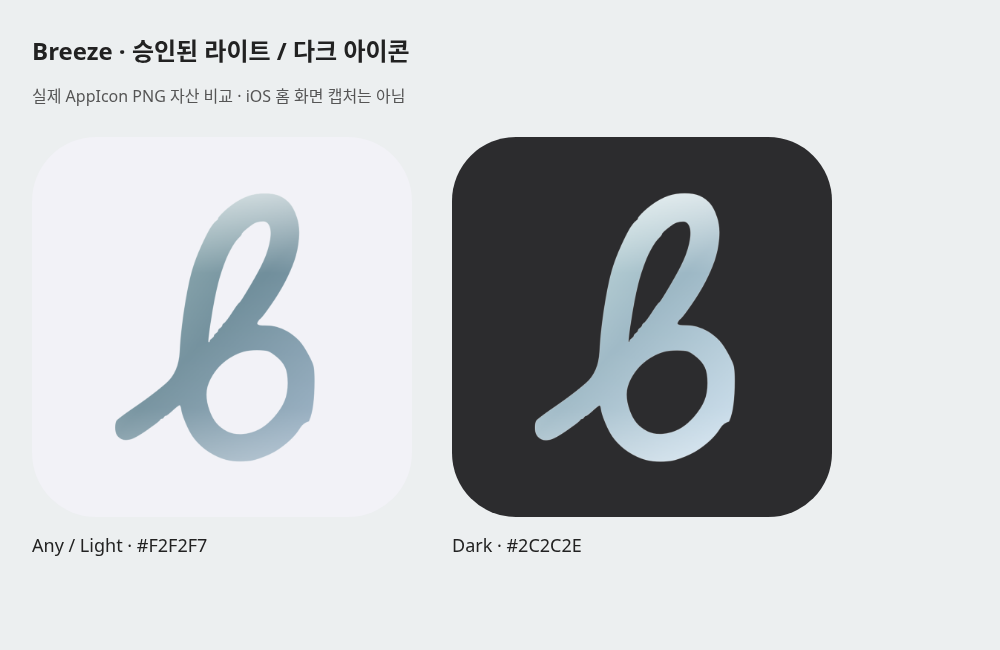
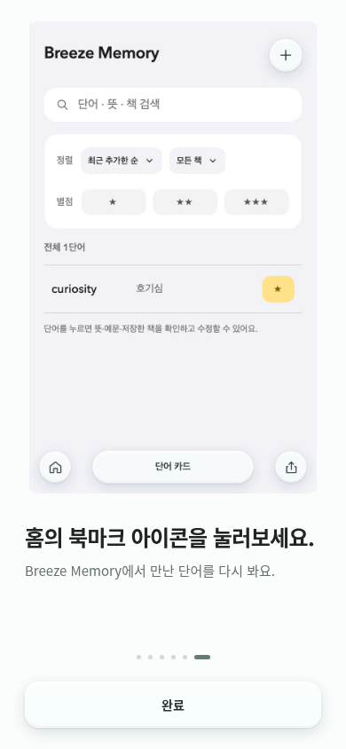
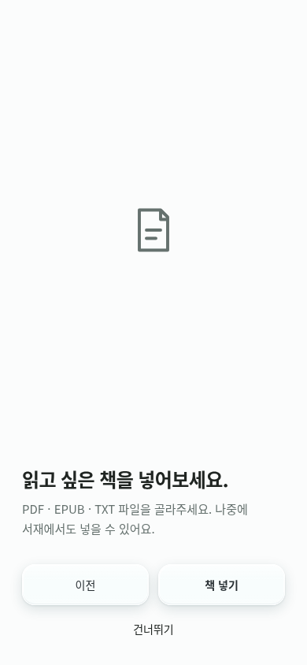
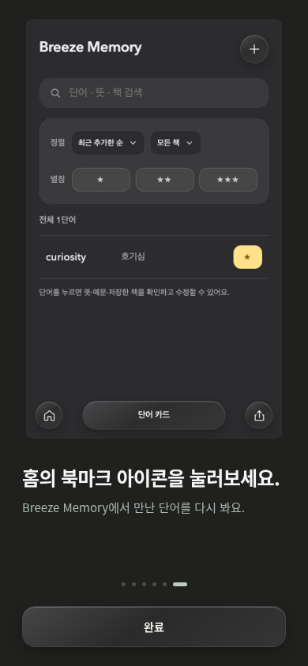
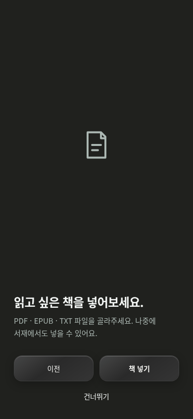
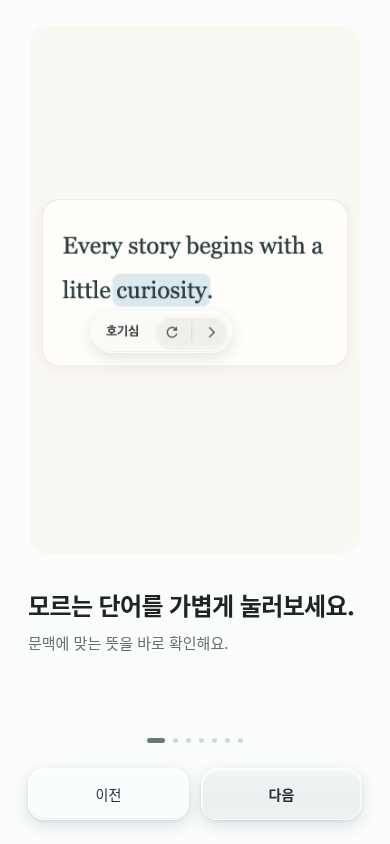
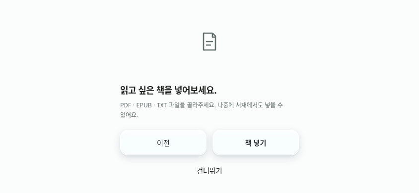
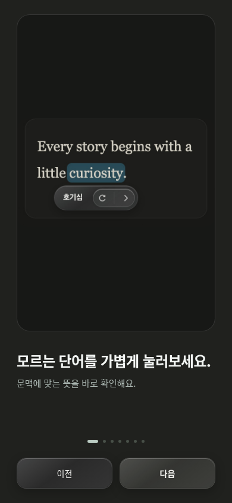
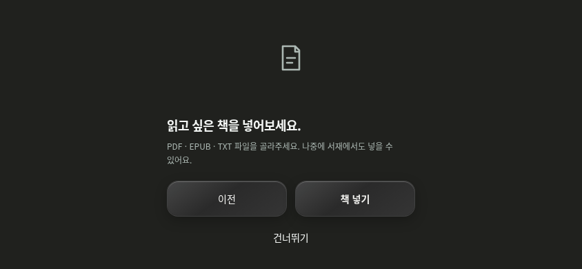

# Icon appearance and onboarding follow-up

Base: submitted Breeze 1.9 (253), `7bed00f9f5e1bb5cbba68f7d921081b5be7f7d65`, PR132. Main was still `e7b61d5304d20d639d45fc8dd23116db5d6446e5`; PR132 was open/draft/unmerged when checked. Work uses `codex/icon-appearance-onboarding-20261009`, preserving all 253 features and App/Share version/build metadata. This draft performs no merge, deployment, signing, upload or App Review action.

## Actual findings and behavior

253 supplied only one Any iOS icon (dark background). The stored light flow-b PNG has the same path geometry and placement. It is now the native Any/light icon; the existing submitted PNG remains unchanged in the Dark luminosity slot. No alternate-icon API or app-theme coupling is added. The system generates the unspecified Tinted treatment. Older iOS uses Any/light. [Apple's appearance guidance](https://developer.apple.com/documentation/xcode/configuring-your-app-icon).

Android's adaptive, monochrome and legacy assets/configuration are unchanged. Themed icons require the user's themed-icon choice and launcher support; launcher dark mode alone does not guarantee a colored light/dark switch. [Android's launcher requirements](https://developer.android.com/develop/ui/compose/system/icon_design_adaptive). A whole-app theme setting redesign is deferred as a separate proposal.

253 ended on the Memory film with “완료”, with no book page. Previous was visually clipped until keyboard focus. The films and welcome remain unchanged. Previous/Next are now visible; horizontal swipe also works over captions and the final page. The six/seven explanation progress marks retain their approved dimensions and positions.

A new last page offers “책 넣기 / 건너뛰기”. File choice calls the existing `importFile` with a session AbortSignal. Cancel and failure keep the page retryable; successful durable import or explicit Skip records completion. Previous, Skip, Escape, external navigation and replay invalidate pending work. Imported books are saved normally and remain after reload. Replay begins at the static welcome and preserves existing books, Reader position and preferences.

## Review images

These are real Chromium app screenshots and actual AppIcon PNGs. They do **not** represent an iOS SpringBoard or physical-device capture. PNG corner rounding in the comparison is a presentation mask only; shipped icon pixels are opaque squares.

| 253 final screen | New book page |
| --- | --- |
|  |  |
|  |  |

| Visible Previous/Next | Short viewport book page |
| --- | --- |
|  |  |
|  |  |

## Local final-source verification

- `npm test`: full suite passed on Node24.19.0, no skipped assertions or changed baseline.
- `npm run typecheck`: passed, unchanged 32 diagnostics.
- `npm run test:brand-icons`: native appearance entries, exact approved PNG bytes, opaque 1024-square corners, identical b contours, and all existing Android safe-area layers passed.
- `BREEZE_BROWSER_EXECUTABLE=/usr/bin/chromium npm run test:onboarding`: passed. Existing welcome timing/41 CSS samples, posters/video lifetime, visibility/reduced-motion/autoplay, first-run resume, Reader isolation and seven-mark geometry are retained. Added trusted pointer swipes in both directions, Previous/Next, first/final boundaries, picker cancellation, failed EPUB retry, actual TXT import/IndexedDB reload, Settings replay, and pending-import Back/Skip/replay/Escape/navigation cancellation.
- Responsive light/dark screenshots and 44px minimum controls at 390×844, 820×1180, 1440×900, 320×568 and 844×390. Final controls stay inside each viewport.
- `npm run ios:sync`, `verify-native-package`, `verify-native-service-worker`, `npm run test:android`, integration boundary and whitespace checks passed.

Local Playwright Chromium/WebKit downloads returned CDN HTTP403; installed Chromium was used. WebKit playback/gestures and unsigned iOS Simulator/Android compilation must be checked by exact published-head CI. Physical iOS Home Screen Light/Dark/Auto selection, OS picker behavior, Android launcher behavior, hardware safe areas and device media playback remain unverified. No physical-device or store acceptance claim is made.
