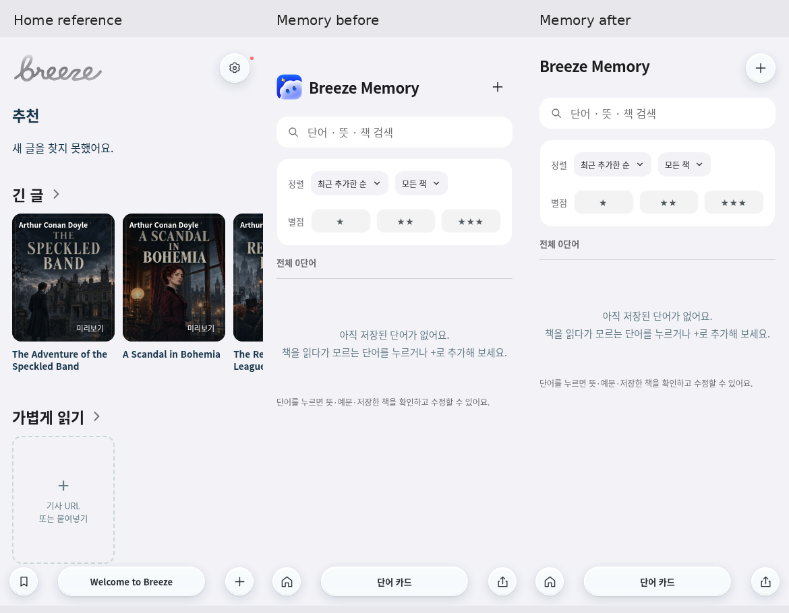
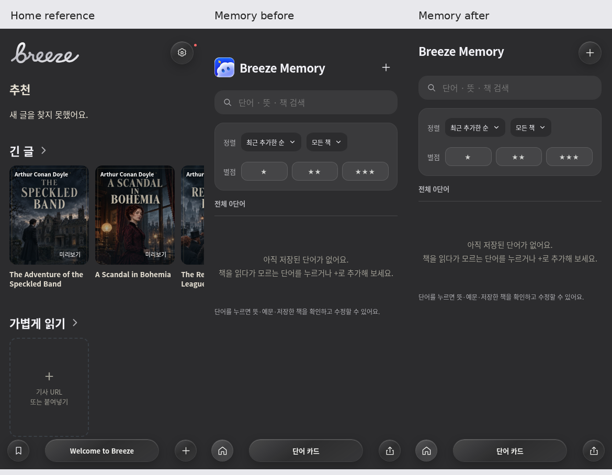

# Memory TestFlight header feedback

Base: main e7b61d5304d20d639d45fc8dd23116db5d6446e5 (PR125).

Remove only the decorative Thunder image in the Memory header. Preserve Breeze
Memory, manual add, filters, review and shared dock. The add control now opts into
existing `.control-glass` material while keeping its 44×44px target, plus SVG,
accessible name and native dialog behavior. Add an explicit keyboard focus ring.
No onboarding, Reader, native build/version or release behavior changes.

## Alignment evidence

Home starts its header at safe-area + 24px; Memory previously started at
safe-area + 52px. Both rendered rows are 44px high. Home's 132px wordmark uses
an 841×258 SVG: its contour reaches the top of the viewBox and nearly the bottom,
so the SVG is not hiding a large blank top margin. Neutral light/dark assets use
the same contour, although light reflections make the upper thin strokes quieter.

Matching top padding alone leaves the title's visible ink below the wordmark
center. Set Memory padding to safe-area + 24px, then translate just its title
up 4px to compensate for the text's baseline/line-box metrics. Do not move the
add button or change the Home logo. Chromium contour/Canvas font measurements:

| 390×844 viewport | Home ink center | Memory before | Memory after |
| --- | ---: | ---: | ---: |
| light and dark, safe area 0 | 45.99px | 79px | 47px |
| light and dark, safe area 59 | 104.99px | 138px | 106px |

The visible-center delta falls from 33.01px to 1.01px. Measurements use alpha
bounds of the rendered SVG and font ascent/descent with the actual DOM baseline,
not equal CSS boxes. Screenshot antialiasing adds roughly a pixel of uncertainty.
The 59px safe-area case substitutes CSS env values in intercepted stylesheets;
it verifies inset propagation, not a physical iPhone or native status bar.

## Verification

- Focused browser test covers light/dark at 390×844, 320×568, 820×1180,
  1440×900 and 844×390, plus a 390×844 safe-area fixture. It asserts visible
  ink-center alignment within 2px, circular nontransparent surface, 44px target,
  accessible name, keyboard open, rapid trusted repeat taps preserving typed
  input, Escape/close/cancel, reopen, save and Home/Memory navigation.
- Existing Wordbook browser suite passes search, sorting, filters, edit, save,
  CSV export and Home navigation. Update its obsolete mascot-presence assertion.
- Existing Home branding/browser and exact design boundary checks pass.
- `npm test`, `npm run typecheck`, JS syntax and `git diff --check` pass.
  Typecheck preserves the existing 34-issue baseline. No standalone lint command
  exists in package.json; use the repository's aggregate structural checks.
- Local browser is system Chromium. Playwright CDN rejects Chromium/WebKit
  downloads with HTTP 403; WebKit coverage runs in the existing two-engine
  design-brand CI matrix, now including the focused Memory test and artifacts.
- Library's prepared-upload helper failed at app discovery with a network error,
  before uploads were prepared. PNG proofs remain in this PR and the workspace.

Onboarding remains idea-only here; PR122/124 remain untouched. A separate
onboarding concept task owns any proposal. This PR is draft; no merge, deployment
or TestFlight upload is authorized by this feedback task.
