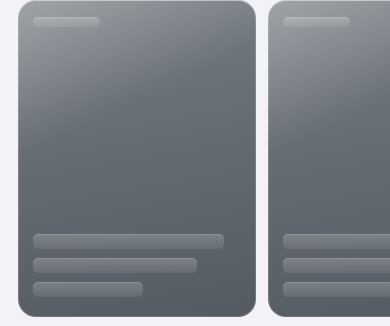
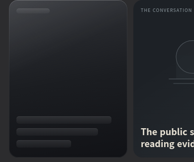

# RSS cover loading shimmer after 1.8 (239)

Base: main `7a5e0c25f2b87791dad6687719e4fb3eb4585c1a` (PR #101).
Tested RSS source SHA-256: `995029bd4bf9f5f361736d3b60eebac68ea4672abde9c01a1a480004f546a506`.

The user requested the existing shimmer while finding a cover. An admitted
visible metadata lookup and actual image loading/decoding now own
`rss-cover-pending`, independently of card interaction. Known metadata opens
Preview immediately. No-photo, error, cancellation and existing timeouts return
to the existing artwork; never-attempted, offscreen, budget-ineligible and
negative-cache cards do not shimmer. Decoded photographs retain priority.

The two-lookups-per-discovery-generation budget, serial/coalesced requests,
24-hour positive/30-minute negative metadata cache, 128 KiB retained prefix,
existing image fallback transport, Smart Crop and selected-only body preparation
remain in place. Same-URL refresh retains a pending or decoded image. Replacement
and view exit cancel pending presentation and prevent a late image from painting.

## Browser evidence

[Exact-source receipts](rss-cover-shimmer-20261006.json) record 20 Chromium
scenarios on the real app/DOM/IndexedDB with synthetic feeds, images and streamed
relay JSON. No live publisher, API key, server mutation, paid request or Jev run
is used. Lookup/request limits have the same measurement qualifications as
[the previous cover QA](rss-visible-covers-20261005.md).

| Scenario | Result |
| --- | --- |
| Cold/warm/offscreen/global budget | Two serial visible lookups; same-URL warm refresh/reload adds none; unattempted cards stay usable artwork |
| Supplied photo/alternate metadata | Supplied photo priority, OG/Twitter/first-image lookup, late-prefix fallback and cache/security rules preserved |
| Metadata to image decode | Pending starts only when admitted; persists through real image loading; ends when decoded |
| Repeated refresh during image load | Same DOM/image retained; no duplicate image load or same-URL metadata lookup |
| Empty/error/timeout/image failure/decode timeout | Pending ends to artwork; cards remain keyboard/tap accessible; negative-cache refresh adds no lookup |
| Cancellation/rotation/scroll/navigation | Aborted or abort-insensitive late completions cannot paint/cache obsolete metadata; pending image navigation also ends |
| Canceled photo resumption | Same card resumes once after document visibility, Preview dismissal and Home return (including unchanged stamp); stale completion cannot clear resumed work; terminal image failures never auto retry |
| Known-metadata Preview during pending image | Sheet opens synchronously with title/source; cover pending does not block entry |
| Light/dark/geometry/reduced motion | Same smoke/graphite material; no card size change; reduced motion disables shimmer |

Light/dark were checked at 390×844, 820×1024, 1440×900, 320×568 and 844×390.
The matrix explicitly stages the existing pending CSS state for consistent
captures; the light lookup capture below is taken during an actual delayed lookup.
The image timeout fixture holds browser decode and accelerates only the existing
4-second image and 15-second metadata timers. It does not change product budgets.





## Validation and release boundary

- Added Node regression cases cover admission/terminal release, negative and
  ineligible/budget/offline states, cancellation and stale-owner handoff.
- Chromium RSS card/tap, supplied-cover mapping/failure/hotlink, visible-cover
  and current-only enrichment comparison checks pass.
- Full `npm test`, typecheck and `npm run ios:sync` run for this change; source,
  generated `www` and Capacitor public RSS/CSS/index bytes match.
- Marketing version remains 1.8. The checked-in build baseline and existing
  Cloud build-number override are unchanged; 240 is not hardcoded.
- Local WebKit download is blocked by HTTP 403 from all Playwright download
  hosts. The existing Integrity browser job runs the extended checks in both
  Chromium and WebKit and uploads its receipts/screenshots.

PR #102 Apple automation remains separate and unmerged. This change does not
merge, archive, upload or request an Apple build. Native device/WKWebView remains
a parent release-review step.

## Review follow-up and controlled request comparison

Review found a real cancellation gap: `photoStarted` survived after cancellation
removed the image src. Only explicit cancellation now clears that marker;
terminal failures retain it. Current visible rail metadata restarts paused images,
including the unchanged-stamp paint path. Preview dismissal reattaches the rail's
existing cover owner without fetching feeds. The ingestion relay-recovery fixture
now uses the same complete URL/photo entry as its card, preserving the original
assertion and the production identity guard.

[Controlled receipts](rss-cover-shimmer-cost-20261006.json) compare exact PR101
`7a5e0c25` RSS and final PR103 RSS on the same shell, with catalog OFF and the
existing visible-cover synthetic transport. Both versions produce identical
request counts and full fixture response-body sums in all stages:

| Stage/profile | Feed requests | Cover metadata requests | Image requests | Full mock response-body bytes |
| --- | ---: | ---: | ---: | ---: |
| Cold Home, both visible feed photos missing | 13 | 2 | 4 | 5,145,107 |
| Cold Home, all feed photos supplied | 13 | 0 | 15 | 3,532,173 |
| Three same-document Home renders + two warm refreshes, each | 0 | 0 | 0 | 0 |
| Warm reload, missing-photo profile | 0 | 0 | 2 | 470,300 |
| Warm reload, supplied-photo profile | 0 | 0 | 13 | 3,056,950 |

Image counts include the unchanged Smart Crop recovery; route interception
disables the browser HTTP image cache, so document reload fetches image fixtures
again. The shimmer adds zero normal-path requests. Legitimate cancellation and
resumption adds exactly one replacement image load for the paused image, with
no extra metadata lookup in the regression fixtures; terminal failures do not
restart. These are separate from cold/warm normal-path counts above.

The byte sum includes the full generated serialized metadata response, although
the client cancels its stream after finding the photo. Actual reader bytes and
client-read totals are recorded separately. The two cold missing-photo lookups
use 4,200,578 bytes of generated upstream HTML in each version; this is synthetic
input, not a measurement of live upstream/billed egress. Headers, redirects,
TLS/CDN behavior and production pricing are excluded. This comparison shows no
server-load increase from the shimmer; it does not establish an overall billing
reduction. Prior word/feed optimization percentages are not overall cost ratios.

Reproduce the comparison with:

```sh
BREEZE_QA_ENGINE=chromium BREEZE_BROWSER_EXECUTABLE=/usr/bin/chromium \
  node tests/compare-rss-shimmer-cost-browser.mjs
```
