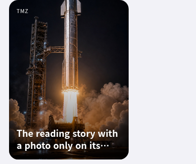
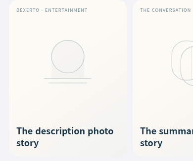
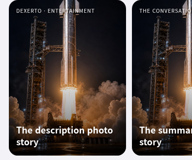

# RSS cover regression after intent optimization — Breeze 1.8(238)

Base: `7f64075aa1a4b82c74ec7bb829409b99d09e6d81`. User reported some discovery
cards without photographs; their exact article/source URL was not supplied.
The user clarified that photographs appeared before the recent RSS/server
optimization and disappeared afterward. Exact source and browser comparison
confirm that removing preselection article enrichment changes those cards.
Separate metadata parsing defects were also found; they already existed before
the optimization and cannot alone explain that chronology.

## Primary regression: removal of article-page cover enrichment

Main build 236 (`34b5dc9ba04ffe0f23c61bd89c0163908bd097c6`) ran
`rssPrepareCovers` for the first three photo-less ordinary entries in a feed.
It fetched and parsed the article page before selection, then assigned its OG
or first body image to the entry's `photo`. PR97 (`d103bb31`) still did this,
with a reduced cover-lookup budget and public-cache reuse.

PR99's intent-only change, integrated into main build 238 (`7f64075`), removed
that page fetch. An unchanged photo-less feed entry now displays local artwork;
its article is fetched only when selected. Before this repair, selection could
show the OG photo in Preview while the Home discovery entry/card stayed on
artwork. If the article's only image was in its body, the memory draft exposed
no Preview cover either. The initial metadata-only fixes (`4e24903`) did not
repair either of these article-page-only cases.

The selected-intent fix uses the already prepared draft's cover to update the
same current discovery entry's `photo` and refresh its connected matching card.
It adds no article request, body cache, durable image or discovery-cache schema.
If refresh replaced the entry while preparation was pending, its old result
cannot mutate the replacement. Supplied feed photos remain authoritative.
Draft photo precedence is OG cover, supplied feed photo, then an existing body
image; no extra fetch is needed to find that image.

### Controlled historical reproduction

`compare-rss-cover-enrichment-browser.mjs` runs exact historical RSS **and article
importer** scripts on one common app shell. One synthetic TMZ feed supplies no
photo; its article supplies either an OG photo or a body-only photo. These are
synthetic transports, not a claim about TMZ's current response. Both cases use
the same feed/article response across versions. No live request leaves the test.

| Version | Article requests before selection | Home photo before selection | Article requests on selection | Preview photo after selection (OG / body-only) | Home photo after selection |
| --- | ---: | --- | ---: | --- | --- |
| Main236 | 1 | Yes | 0 | Yes / Yes | Yes |
| PR97 | 1 | Yes | 0 | Yes / Yes | Yes |
| Main238 | 0 | No: artwork | 1 | Yes / No | No: artwork |
| Metadata-only fixes (`4e24903`) | 0 | No: artwork | 1 | Yes / No | No: artwork |
| Selected-intent fix | 0 | No: artwork | 1 | Yes / Yes | Yes |

All ten Chromium comparison cases pass. The selected fix also preserves its
Home photo through a normal rerender, saves no book on Preview/dismissal, and
does not write its selected photo into the durable public-feed cache. Exact
source SHA256 values, request records and screenshots are in
the committed [comparison results](rss-cover-enrichment-20261005.json). All
screenshots remain in `/tmp/breeze-rss-enrichment-comparison/`.
This isolates code behavior; it is not five independently deployed native builds.

The retained Home card after selecting the body-only image fixture:



**Remaining product tradeoff:** a cold, unselected card whose feed supplies no
photo still uses artwork. Its source-page photo cannot appear before fetching
that page unless authorized metadata already supplies it. Reinstating all of
the old initial photographs would therefore conflict with the requested
no-eager-article-fetch invariant. The selected photo is memory-only and can
return to artwork on document relaunch or a fresh feed replacement. This patch
does not promise photographs on every initially unselected discovery card.

## Separate supplied-feed metadata defects

`parseRss` chooses full content before description/summary for its body. The
old `rssImage` inspected only that chosen HTML, although a publisher can put its
image in a different supplied description/summary. It also accepted a Media RSS
video declaration without a MIME type before a valid thumbnail, and rejected
uppercase image MIME types.

`rssImage` now checks the already supplied content/description/summary fields
after the existing declared-image priority, skips explicitly non-image media,
and compares MIME types case insensitively. Existing URL validation, tracking
pixel exclusion, responsive-image choice and photo decode/relay recovery remain
the owners of their respective behavior. There is no new state or request.

Decision 015's product contract is preserved: no discovery article-body fetch;
absent or failed photographs keep existing local artwork, readable headline and
source, and the same selectable card footprint. No source is hidden solely for
having no photograph. The shared catalog remains OFF. Existing metadata-only
public caches refresh naturally at expiry or an explicit refresh; no personal
book, history or cover storage is migrated.

## Before/after evidence

The same synthetic feeds and bundled sample image are used in these captures.
Publisher labels are fixture identities, not a claim about a current publisher's
actual feed. The first card has image-less full content and a description photo;
the next has image-less Atom content and a summary photo.

| Before: available metadata photo was lost | After: same supplied photo is displayed |
| --- | --- |
|  |  |

Before adding the six selected-cover cases, running the original eight cases
in `tests/verify-rss-covers.mjs` against the exact base `rss.js` failed six:
description/Atom-summary photos, video-before-thumbnail, MIME casing,
responsive supplementary photo, and parsed-photo public-cache retention. The
unchanged unsafe/tracking-photo and true-image-absence tests pass. The base
browser test fails on description photo `actual: ''`, and records summary and
responsive photos missing and video URL chosen instead of thumbnail.

## Verification

- Fourteen Node tests pass: the original eight metadata/loading cases and six
  selected-cover/draft-precedence cases. The tests exercise production functions.
  JS syntax and whitespace pass.
- Existing `verify-rss-card-browser.mjs` and `verify-ingestion-browser.mjs`
  also pass in Chromium, covering long-press/tap, refresh positioning, article
  ingestion, import fallback, source semantics and mobile Reader.
- Chromium runs the real feed parser, transport, bounded public cache,
  recommendation/card rendering and Preview with mocked network. It verifies
  supplementary/declared/responsive photos, a malformed URL and tracking pixel,
  missing publisher photo, invalid image response, direct-hotlink failure plus
  successful existing image relay recovery, source/category mapping, English and
  promotional filtering, and saved-source exclusion.
- Before selection: 13 public feeds, **zero article-body requests**, no book
  persistence, catalog OFF. A selected ordinary article then makes one body
  request; closing Preview before Read preserves zero saved books.
- Ten light/dark viewport captures pass 3:4 photo/fallback geometry: 390×844,
  820×1180, 1440×900, 320×568 and 844×390. Full captures and request/DOM evidence:
  `/tmp/breeze-rss-cover-qa/` locally; CI uses `BREEZE_RSS_COVER_PROOF` for its
  uploaded artifact folder. Two representative images are retained above.

Reproduce focused tests:

```sh
node --test tests/verify-rss-covers.mjs tests/verify-rss-recommendation.mjs
BREEZE_QA_ENGINE=chromium BREEZE_BROWSER_EXECUTABLE=/usr/bin/chromium \
  node tests/verify-rss-covers-browser.mjs
BREEZE_BROWSER_EXECUTABLE=/usr/bin/chromium \
  node tests/compare-rss-cover-enrichment-browser.mjs
```

Historical comparison requires local Git history. CI sets
`BREEZE_RSS_ENRICHMENT_CURRENT_ONLY=1`, which bypasses every `git show` and checks
both OG/body-only fixtures against current source in Chromium and WebKit. Its
`BREEZE_RSS_ENRICHMENT_PROOF` directory contains assertions, requests and images.

The new browser test defaults to Chromium and WebKit. Local WebKit could not run:
all Playwright browser download hosts returned HTTP 403 `Domain forbidden`.
Direct live-feed reads returned tunnel HTTP 403; the web reader rejected RSS/XML
content types. Thus publisher availability and the user's exact failing card
remain unverified. No live server mutation or paid-provider request occurred.
Browser mocks establish mapping/rendering behavior, not native iOS or WKWebView
availability. Final aggregate validation and remote CI belong to the combined PR.
