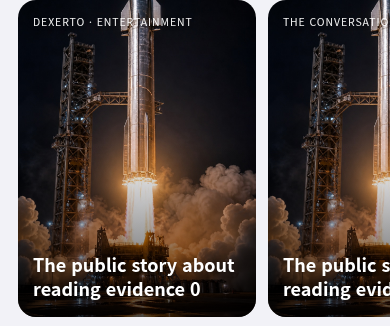

# Visible RSS cover restoration after build 238

The user clarified that the first Home photographs disappeared after the recent
RSS optimization and authorized bounded initial-card lookup in the same PR.
Build 236 and PR97 recovered missing feed photographs by fetching article pages
before selection. Build 238 removed that enrichment. Metadata parsing fixes and
selected-only projection did not restore the initial Home photograph.

The final change first uses a supplied feed photo or fresh cached public photo.
For currently visible ordinary entries from the fixed public feeds, it may look
up missing cover metadata through the existing article relay. The complete
discovery generation shares **two lookups maximum** across rail owners; jobs
are serial and same-URL consumers coalesce. Offscreen cards make no lookup.
No Readability body preparation, article draft, personal book or image write is
performed by this lookup. Selected reading still fetches/parses its actual body.

Positive photo metadata expires after 24 hours; empty metadata expires after
30 minutes. Public URL metadata is bounded to 100 records and 64,000 UTF-8
bytes. IP literals, local hosts, credentials, sensitive query parameters and
signed AWS/Google credential URLs are rejected. This is a separate cover-only
cache; supplied feed data, saved books and personal reading state keep their
existing owners. Default shared catalog/quality activation is unchanged. The
optional shared catalog retains its single metadata response without client
cover lookups; its current-only Chromium browser contract also passes.

Supplied photos retain priority. A supplied photo that fails decoding keeps
existing artwork; this repair does not replace every supplied image failure
with another article lookup. A missing photograph outside the visible/two-job
budget, beyond the parsing prefix, or unavailable from the publisher can also
retain artwork. These cards remain usable.

## Real-browser evidence

[Committed evidence](rss-visible-covers-20261005.json) records exact RSS source
SHA256, DOM/IndexedDB state, relay requests, retained parsing lengths and actual
stream read/writer bytes. The test serves immutable current RSS source on the
real app; all feeds, images and relay responses are synthetic. There is no live
publisher request, service mutation or paid call.

Chromium passes eight scenarios in `verify-rss-visible-covers-browser.mjs`:

| Scenario | Verified result |
| --- | --- |
| Cold first screen | Both visible photo-less cards obtain their OG photos before any click; exactly two serial relay lookups |
| Warm refresh/reload | Repeated same-URL refresh and document reload make zero additional cover lookups |
| Offscreen/global budget | Initially offscreen entries do not look up metadata; scrolling and another visible rail cannot spend beyond the same generation's two jobs |
| Supplied photo | No cover lookup for the card already carrying a supplied photograph |
| Alternate metadata | Twitter image and existing first body image can supply the photo; a photo after the retained prefix stays artwork |
| Cancellation/rotation | An artificially abort-insensitive late response cannot paint/cache canceled entries; fresh rotation uses its own current entries |
| Scroll-out cancellation | The old visible entry's late result is discarded after scrolling it out; the remaining job serves a currently visible entry |
| Coalescing/security/cache | Two live consumers share one URL job; public-URL rejection, inert parsing, expiry and record/byte bounds pass |

All scenarios retain zero live/durable books, zero IndexedDB images, and zero
prepared article bodies. The active-relay maximum in the cold fixture is one.
The final source hash in the visible-cover test and current-only historical
comparison matches the tested working source.

The initial phone screen, using the bundled sample photo for both fixture cards:



## Prefix limits and remaining transport cost

The repository's relay implementation responds with JSON `{url, html}` after
reading the complete accepted final upstream page, capped at 3,000,000 bytes.
The deployed relay was not inspected. This patch does not deploy or modify
that server. The client decodes an escaped JSON string prefix, parses OG/Twitter
or an existing image in an inert document, retains at most **131,072 bytes** of
response prefix, then cancels the rest.

The fixture generates approximately 2.1 MB of upstream HTML per lookup. The
final Chromium run's maximum retained parsing prefix was 131,072 bytes, while
an actual delivered reader chunk caused total `readBytes` to reach 466,944 bytes.
Local server writer bytes are recorded separately and can be larger again.
Thus retained parsing is bounded; delivered chunks, upstream reads and billed
egress are not bounded by 128 KiB. The production relay can still incur its
full-page cost for each of the two admitted cold lookups. Redirect bodies,
protocol overhead, buffering and image traffic add other costs; the two-job
limit and final-page cap are not an overall upstream/wire/billing bound.
These successful fixtures contain no redirects and are not a Supabase billing
forecast.

## Historical comparison and limits

`compare-rss-cover-enrichment-browser.mjs` retains exact build-236, PR97,
build-238 and metadata-only sources, and checks the current fix with both
OG-only and body-only article fixtures. Current Home obtains the visible photo
through one metadata relay request before clicking, prepares no body, and then
makes one body request on selection. Preview and Home keep the photograph.
The historical full comparison's ten cases and final current-only two cases pass.
See [chronology and comparison evidence](rss-covers-20261005.md).

```sh
BREEZE_QA_ENGINE=chromium BREEZE_BROWSER_EXECUTABLE=/usr/bin/chromium \
  node tests/verify-rss-visible-covers-browser.mjs
BREEZE_RSS_ENRICHMENT_CURRENT_ONLY=1 BREEZE_BROWSER_EXECUTABLE=/usr/bin/chromium \
  node tests/compare-rss-cover-enrichment-browser.mjs
```

Both browser tests support WebKit in CI; local browser download hosts returned
HTTP 403. Native iOS/WKWebView, native Photo Library, live publisher availability
and production relay cost remain unverified locally. Full artifacts are at
`/tmp/breeze-rss-visible-covers/` and `/tmp/breeze-rss-enrichment-comparison/`;
CI uses `BREEZE_RSS_VISIBLE_COVER_PROOF` and `BREEZE_RSS_ENRICHMENT_PROOF`.
