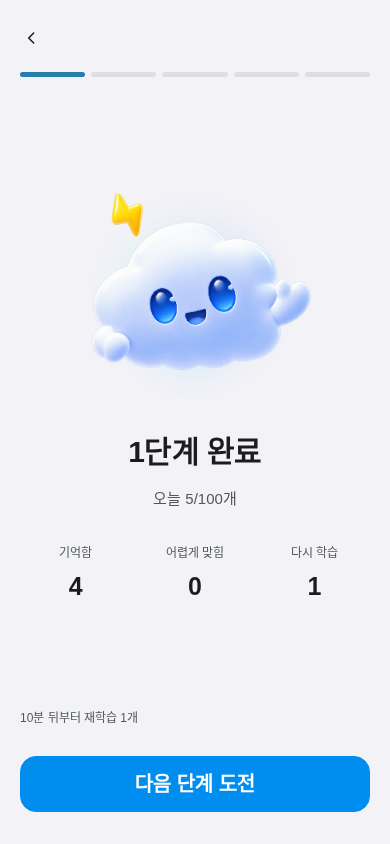

# Vocabulary review: daily maximum, relearning and five stages

Initial base: `3628d67f1ad09138a102475e49ddcedf05c5c0bc`.
Latest main rechecked: `8d302df` (five Thunderhead assets and their documentation).
The new assets are connected to stage completion; no review code changed on main.
Previous review base: `e5864ac`. Review engine/UI are unchanged between those
bases; the intervening commits contain agent guidance and reader improvements.
Read AGENTS.md, DESIGN.md and decisions 003, 012, 013 before changing this area.

Verified on main: the due/new inventory was combined, Today always selected five,
manual practice advanced scheduled intervals, uncertain imposed one hour and
stage demotion, Selection Done cleared checks, source title/context changed card
identity, and starting another scope replaced the unfinished queue. Existing
per-Meaning filtering, durable progress, token rejection and write-before-advance
were present and have been retained.

## Implemented behavior

- One combined daily maximum, including zero, and automatic five-card microbatches.
  Backlog inventory is not a recommended amount; unlearned cards are not overdue.
- Failed recall persists as timed relearning. Correct difficult recall retains
  its day stage; normal recall advances the fixed ladder. No FSRS/Anki algorithm claim.
- Daily distinct card sets and regular/practice response history commit with each
  assessment. Relearning does not double-count cards; local midnight resets budgets.
- Explicit practice never changes scheduling or regular limits. Selection Done
  preserves checks; empty selections/filters cannot expand to all vocabulary.
- v1 migration preserves progress/queues and backs up the original JSON. Title
  and example edits preserve identity. Scope switching parks unfinished sessions.
- Memory has no quantity control or setup sheet. Existing app settings contain
  one daily maximum; the center pill starts immediately. New/review remain
  separate record categories but share the maximum. Legacy settings and sessions
  are retained, with the saved review limit initializing the unified maximum.

- Daily goals have five increasing stages (100 cards: 5 / 10 / 20 / 30 / 35).
  Goal and integer stage boundaries persist; stages never get smaller due to
  rounding. Small goals have fewer stages. Failures earn progress; retries do not
  earn duplicate cards. All five supplied Thunderhead assets are connected, enlarged to 200–260px.
  Completion keeps one vivid-blue Next Stage CTA, a back arrow, and unboxed
  daily counts for remembered / difficult / relearning; redundant labels are removed. A static aurora expands and brightens behind the
  mascot at each stage; browser tests assert the increasing opacity.

## Validation

- `npm test`: passed (full repository suite).
- `node --test tests/verify-vocabulary-review.mjs tests/verify-vocabulary-review-highlight.mjs`:
  passed, 59 tests, including 2,000 new / 1,000 overdue fixtures, separate/zero budgets,
  explicit extras, same-card relearning, early practice, interrupted queues,
  local date changes, v1 migration, content identity and exactly-once retry.
- `npm run typecheck`: passed, existing 34 diagnostics unchanged.
- `node tests/verify-vocabulary-review-browser.mjs`: Chromium, 18 scenarios passed.
- `BROWSER=webkit node tests/verify-vocabulary-review-browser.mjs`: WebKit, 18 scenarios passed.
  On this Linux worker, missing runtime libraries were extracted from the configured
  Debian package repository into temporary user space and linked into the downloaded
  Playwright bundle. Its system-library preflight was bypassed after satisfying the
  actual loader dependencies; the real WebKit scenarios ran, not mocks.
- Browser cases include selection Done/cancel/uncheck/empty search, practice batching
  through reload, v1 backup, failed grade/settings/start writes, duplicate clicks, answer gating,
  single-cap presets/direct input, absence of slider/separate new limit, reload of settings, Escape and Back/Forward,
  and no vocabulary mutation or AI requests. A 100-card browser journey checks all
  five actual PNGs, 5/15/35/65/100 milestones, failure credit and saved achievements.
  Core tests also cover 300 cards, capped 60 of 100, 1–350 integer goal allocations,
  later-day relearning, milestone retries and goal changes.
- Light/dark card, completion, minimal Memory entry and app settings layouts:
  320×740, 390×844, 820×1180, 1440×900, 844×390 and 320×360. Checked overflow,
  reachable controls and 44px targets; actual captures inspected.
- `git diff --check`: passed. Asset hashes/service worker were regenerated by the
  repository stamping tool; no deployment was performed.

## Captures

The fixtures contain 20 new cards and no scheduled review backlog; the chosen
daily maximum is 8, demonstrating direct input.

| Light | Dark |
| --- | --- |
|  |  |

| Stage 1 (5/100), light | Stage 5 (100/100), dark |
| --- | --- |
|  |  |

## Remaining limitations / not run

- Physical iPhone/iPad WebView, OS keyboard/safe-area behavior and VoiceOver were
  not tested. Linux WebKit and short viewports do not establish physical-device behavior.
- v1 lacks exact historical response totals and new/review classification. Migration
  preserves the latest known progress and reserves its distinct cards against
  the last recorded day’s maximum; settings identify the included legacy records. Historical events are not invented.
- LocalStorage has no cross-tab CAS. Sequential double clicks/retries are covered;
  simultaneous writes in separate tabs can still race, as before. No server/account
  or cloud sync was added. Full event history consumes local quota over time; quota
  failures remain explicit and retryable without partial advancement.
- Calendar rollover follows the device timezone; changing timezone can change which
  daily budget is active. FSRS is a separate future scheduler project.
