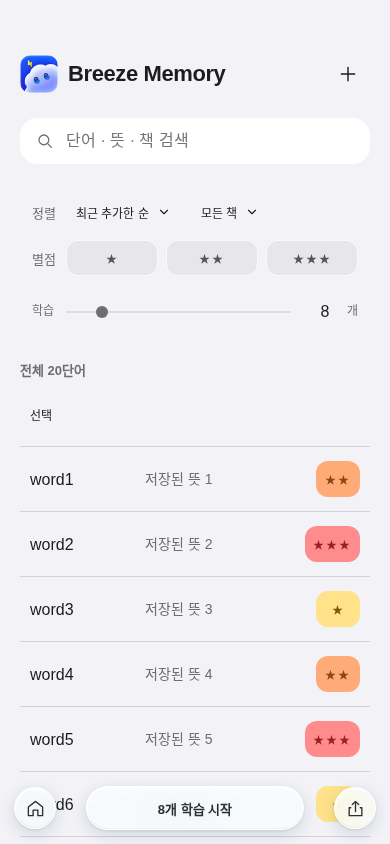
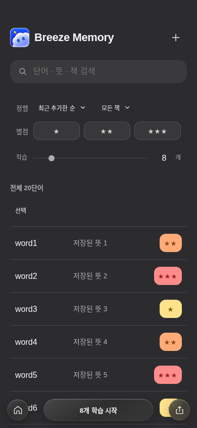

# Vocabulary review: limits, relearning and inline amount controls

Base: latest fetched main `3628d67f1ad09138a102475e49ddcedf05c5c0bc`.
Previous review base: `e5864ac`. Review engine/UI are unchanged between those
bases; the intervening commits contain agent guidance and reader improvements.
Read AGENTS.md, DESIGN.md and decisions 003, 012, 013 before changing this area.

Verified on main: the due/new inventory was combined, Today always selected five,
manual practice advanced scheduled intervals, uncertain imposed one hour and
stage demotion, Selection Done cleared checks, source title/context changed card
identity, and starting another scope replaced the unfinished queue. Existing
per-Meaning filtering, durable progress, token rejection and write-before-advance
were present and have been retained.

## Implemented behavior

- Independent daily new/review budgets, including zero, and 5/10/20/custom batches.
  Backlog inventory is not a recommended amount; unlearned cards are not overdue.
- Failed recall persists as timed relearning. Correct difficult recall retains
  its day stage; normal recall advances the fixed ladder. No FSRS/Anki algorithm claim.
- Daily distinct card sets and regular/practice response history commit with each
  assessment. Relearning does not double-count cards; local midnight resets budgets.
- Explicit practice never changes scheduling or regular limits. Selection Done
  preserves checks; empty selections/filters cannot expand to all vocabulary.
- v1 migration preserves progress/queues and backs up the original JSON. Title
  and example edits preserve identity. Scope switching parks unfinished sessions.
- Below the star filters, a single draggable batch slider and numeric input
  control the amount. Daily limits and usage statistics live in app settings.
  The center pill starts immediately, preserving all original dock slots. Completion
  separates the batch from pending relearning and offers More / Stop.

## Validation

- `npm test`: passed (full repository suite).
- `node --test tests/verify-vocabulary-review.mjs tests/verify-vocabulary-review-highlight.mjs`:
  passed, 48 tests, including 2,000 new / 1,000 overdue fixtures, separate/zero budgets,
  explicit extras, same-card relearning, early practice, interrupted queues,
  local date changes, v1 migration, content identity and exactly-once retry.
- `npm run typecheck`: passed, existing 34 diagnostics unchanged.
- `node tests/verify-vocabulary-review-browser.mjs`: Chromium, 17 scenarios passed.
- `BROWSER=webkit node tests/verify-vocabulary-review-browser.mjs`: WebKit, 17 scenarios passed.
  On this Linux worker, missing runtime libraries were extracted from the configured
  Debian package repository into temporary user space and linked into the downloaded
  Playwright bundle. Its system-library preflight was bypassed after satisfying the
  actual loader dependencies; the real WebKit scenarios ran, not mocks.
- Browser cases include selection Done/cancel/uncheck/empty search, practice batching
  through reload, v1 backup, failed grade/settings/start writes, duplicate clicks, answer gating,
  drag/keyboard/direct input, reload of settings, Escape and Back/Forward,
  and no vocabulary mutation or AI requests.
- Light/dark card, completion, inline amount controls and app settings layouts:
  320×740, 390×844, 820×1180, 1440×900, 844×390 and 320×360. Checked overflow,
  reachable controls and 44px targets; actual captures inspected.
- `git diff --check`: passed. Asset hashes/service worker were regenerated by the
  repository stamping tool; no deployment was performed.

## Captures

The fixtures contain 20 new cards and no scheduled review backlog; the chosen
batch size is 8, demonstrating direct input.

| Light | Dark |
| --- | --- |
|  |  |

## Remaining limitations / not run

- Physical iPhone/iPad WebView, OS keyboard/safe-area behavior and VoiceOver were
  not tested. Linux WebKit and short viewports do not establish physical-device behavior.
- v1 lacks exact historical response totals and new/review classification. Migration
  preserves the latest known progress and conservatively reserves both budgets for
  its last recorded day; the settings explain this. Historical events are not invented.
- LocalStorage has no cross-tab CAS. Sequential double clicks/retries are covered;
  simultaneous writes in separate tabs can still race, as before. No server/account
  or cloud sync was added. Full event history consumes local quota over time; quota
  failures remain explicit and retryable without partial advancement.
- Calendar rollover follows the device timezone; changing timezone can change which
  daily budget is active. FSRS is a separate future scheduler project.
